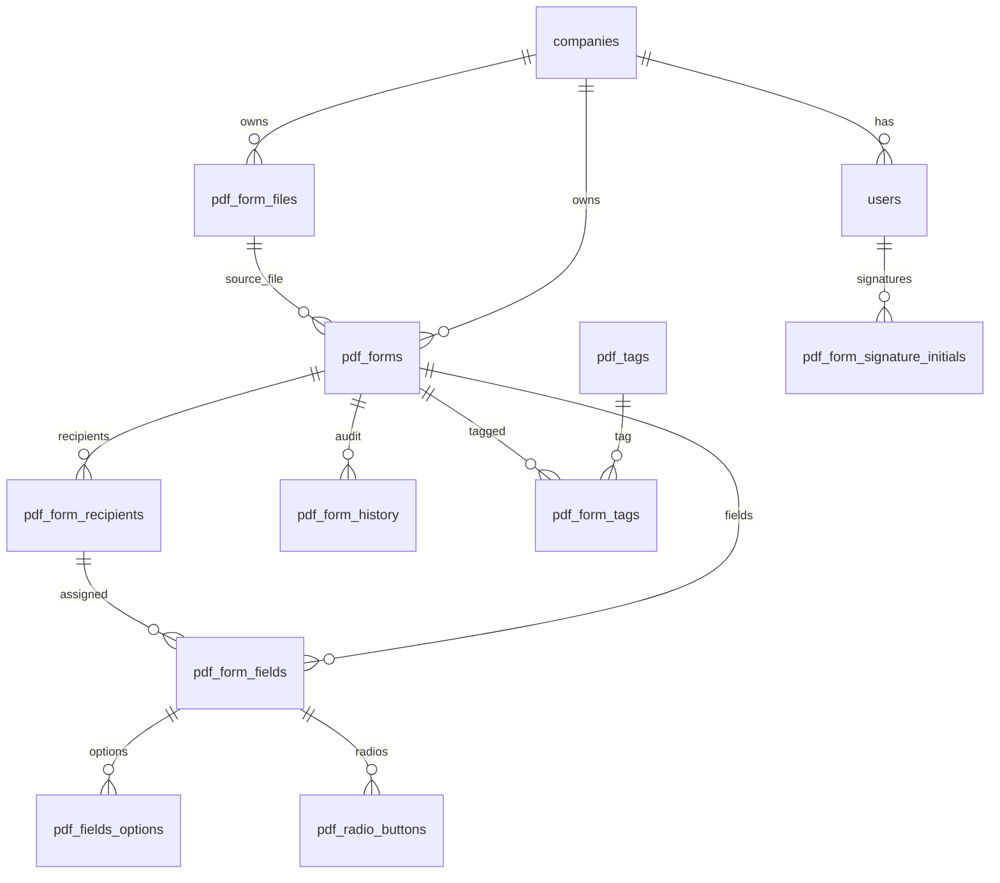

# Database tables index

**Last synced:** 2025-07-12 (migrations batch)  
**Engine:** MySQL via Sequelize

## Core / identity

| Table | Doc | Migration | Model |
|-------|-----|-----------|-------|
| `users` | [users.md](./tables/users.md) | `20250712114536-create_users.js` | `services/users/models/users.model.js` |
| `companies` | [companies.md](./tables/companies.md) | `20250712114000-create_companies.js` | `services/companies/models/companies.model.js` |

## PDF / e-sign domain

| Table | Doc | Migration | Model |
|-------|-----|-----------|-------|
| `pdf_form_files` | [pdf_form_files.md](./tables/pdf_form_files.md) | `20250712120218-pdf_files.js` | `services/pdfForms/models/pdfFormFiles.model.js` |
| `pdf_forms` | [pdf_forms.md](./tables/pdf_forms.md) | `20250712120219-pdf_forms.js` | `services/pdfForms/models/pdfForms.model.js` |
| `pdf_form_recipients` | [pdf_form_recipients.md](./tables/pdf_form_recipients.md) | `20250712120420-pdf_form_recipients.js` | `services/pdfForms/models/pdfFormRecipients.model.js` |
| `pdf_form_fields` | [pdf_form_fields.md](./tables/pdf_form_fields.md) | `20250712120917-pdf_form_fields.js` | `services/pdfForms/models/pdfFormFields.model.js` |
| `pdf_fields_options` | [pdf_fields_options.md](./tables/pdf_fields_options.md) | `20250712124600-pdf_fields_options.js` | `services/pdfForms/models/pdfFieldsOptions.model.js` |
| `pdf_radio_buttons` | [pdf_radio_buttons.md](./tables/pdf_radio_buttons.md) | `20250712124854-pdf_radio_buttons.js` | `services/pdfForms/models/pdfFormRadioButtons.model.js` |
| `pdf_form_history` | [pdf_form_history.md](./tables/pdf_form_history.md) | `20250712125139-pdf_form_history.js` | `services/pdfForms/models/pdfFormHistory.model.js` |
| `pdf_form_reminder_logs` | [pdf_form_reminder_logs.md](./tables/pdf_form_reminder_logs.md) | `20250712125349-pdf_form_reminder_logs.js` | `services/pdfForms/models/pdfFormReminderLogs.model.js` |
| `pdf_form_revoked_users` | [pdf_form_revoked_users.md](./tables/pdf_form_revoked_users.md) | `20250712125548-pdf_form_revoked_users.js` | `services/pdfForms/models/pdfFormRevokedUsers.model.js` |
| `pdf_tags` | [pdf_tags.md](./tables/pdf_tags.md) | `20250712130018-pdf_tags.js` | `services/pdfForms/models/pdfTags.model.js` |
| `pdf_form_tags` | [pdf_form_tags.md](./tables/pdf_form_tags.md) | `20250712125835-pdf_form_tags.js` ⚠️ | `services/pdfForms/models/pdfFormTags.model.js` |
| `pdf_form_signature_initials` | [pdf_form_signature_initials.md](./tables/pdf_form_signature_initials.md) | `20250712130332-pdf_form_signature_initials.js` | `services/pdfForms/models/pdfFormSignatureInitials.model.js` |

⚠️ `pdf_form_tags` migration body does not match the model (see table doc).

## Relationship overview

## Tenant key

Almost all PDF tables require **`company_id`** → `companies.id`.
