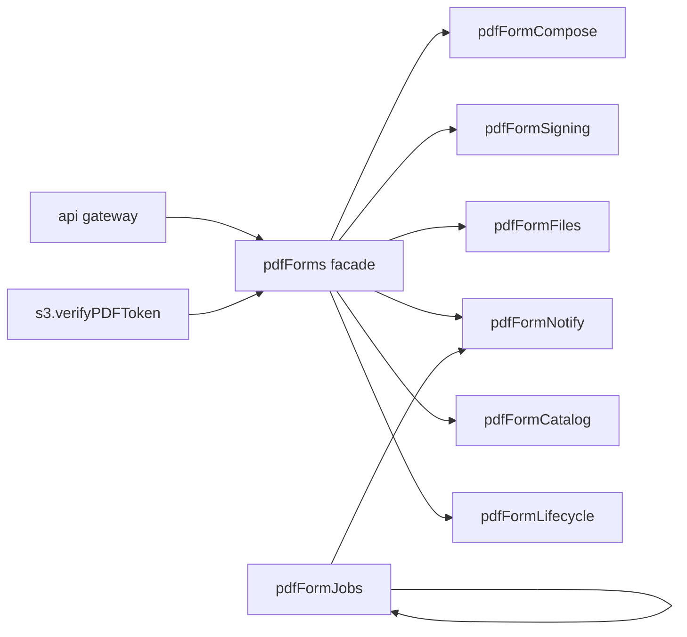

# PDF forms — multi-service architecture

**Last updated:** 2025-05-27

## Overview

The PDF domain is split into **Moleculer services** that can run on separate nodes for scaling. The original `pdfForms` name remains a **facade** so existing callers (`pdfForms.editPdf`, `pdfForms.verifyPDFToken`, routes, S3) keep working.

Business logic still lives in [`pdfForms.methods.js`](../pdfForms.methods.js) (shared via [`shared/pdfFormsBase.mixin.js`](../shared/pdfFormsBase.mixin.js)). Phase 2 can split that file into `methods/compose.js`, `methods/signing.js`, etc.

## Services

| Service | Responsibility | Scale when |
|---------|----------------|------------|
| `pdfFormCompose` | `editPdf` — forms, recipients, fields, tags | Heavy editor / send traffic |
| `pdfFormSigning` | `fillFormFields`, tokens, decline, self-sign | Signing peaks |
| `pdfFormFiles` | Uploads, file library, S3 delete | Upload I/O |
| `pdfFormNotify` | Resend, reminders, reminder cron | Email throughput |
| `pdfFormJobs` | Expiration + retention crons | Background workers |
| `pdfFormCatalog` | Submissions, fields, history, templates, tags | Read-heavy UI |
| `pdfFormLifecycle` | Void, delete, extend expiration | Admin actions |
| `pdfForms` | Facade → delegates to above | API gateway compatibility |

## Call flow



## Crons

Registered on **`pdfFormJobs`** (and `pdfFormNotify` for reminders):

- `pdfFormNotify.sendEmailReminder` — daily
- `pdfFormJobs.checkExpiration` — daily
- `pdfFormJobs.removeFilesOfDeletedForms` — daily

Set `PDF_FORMS_FACADE_CRONS=true` only if you run the facade without `pdfFormJobs`.

## Production scaling (Moleculer)

Example: run signing on dedicated nodes:

```bash
# Node A — API + facade + compose
SERVICES=pdfForms,pdfFormCompose,api moleculer-runner ...

# Node B — signing only
SERVICES=pdfFormSigning moleculer-runner ...
```

Use the same Redis transporter (`moleculer.config.js`) so `ctx.call('pdfFormSigning.fillFormFields')` works across nodes.

## Critical paths

- **`editPdf`** — only on `pdfFormCompose`; uses `prepareRecipientAndEditForm`, transactions, completed-recipient guards.
- **`fillFormFields`** — only on `pdfFormSigning`; multipart, PDF draw/sign, audit.

Do not change action names on the facade without updating API routes and `s3` (`pdfForms.verifyPDFToken`).
