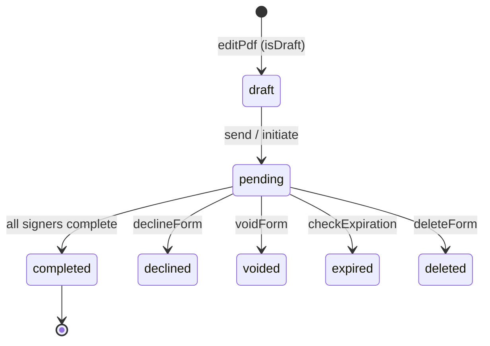
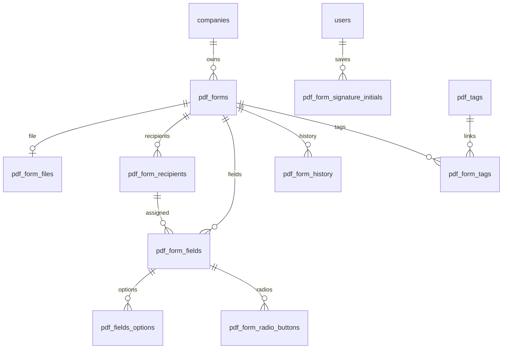

# PDF Forms Service (`pdfForms`)

**Source:** `services/pdfForms/pdfForms.service.js`  
**Business logic:** `services/pdfForms/pdfForms.methods.js` (~10k LOC)  
**Validation:** `services/pdfForms/pdfForms.params.js`  
**Models:** `services/pdfForms/models/*.model.js`

## Role

Core **e-signature / PDF document** domain: upload PDFs, place fields, assign recipients (sequential/parallel signing), send emails, collect signatures, audit trail, templates, tags, void/decline/expire, self-sign, and scheduled maintenance jobs.

## Mixins

| Mixin | Purpose |
|-------|---------|
| `DBmixin("pdfForms")` | Sequelize connection |
| `modelRelationsmixin` | `this.settings.models.pdfForms`, etc. |
| `helperMixin` | JWT, email, RBAC |
| `s3Mixin` | Upload, copy, delete PDFs on S3 |
| `CacheCleanerMixin(["pdfForms"])` | Cache bust |

## Service structure

```
pdfForms/
├── pdfForms.service.js    # Actions + cron registration
├── pdfForms.methods.js    # Handlers (exported functions)
├── pdfForms.params.js     # fastest-validator schemas
├── models/                # 12 Sequelize definitions
└── markdown/
    └── pdf_forms.md
```

## Document lifecycle



**Form statuses (`pdf_forms.status`):** `pending`, `completed`, `voided`, `draft`, `expired`, `declined`, `deleted`

**Recipient statuses (`pdf_form_recipients.status`):** `pending`, `mailed`, `viewed`, `completed`, `revoked`, `void`, `expired`, `bounced`

## Actions reference

| Action | Auth | Params file | Description |
|--------|------|-------------|-------------|
| `editPdf` | Default | `editPdfParams` | Create/edit/duplicate/initiate form or template; fields, recipients, emails |
| `fillFormFields` | Public | — | Signer submits field values + signatures (multipart) |
| `getUserFields` | Public | `getUserFieldsParams` | Load form + fields for token holder |
| `validateFormToken` | Public | `validateFormTokenParams` | Validate signer link; record view |
| `verifyPDFToken` | Public | — | Middleware: resolve `company_id` from token (S3 upload) |
| `declineForm` | Public | `declineFormParams` | Recipient declines with reason |
| `getAllSubmissions` | Default | — | Paginated sent forms for current user |
| `getAllFiles` | Default | — | File library list |
| `uploadPdfFile` | Default | `uploadPdfParams` | Register uploaded S3 files |
| `checkDuplicateFile` | Default | `checkDuplicateFilesParams` | Duplicate filename check |
| `deleteFile` | Default | `deleteTemplateParams` | Soft-delete file record |
| `voidForm` | Default | `voidFormParams` | Void with reason |
| `getAllFields` | Default | `getAllFieldsParams` | Fields for form/template editor |
| `deleteForm` | Default | `deleteFormParams` | Delete with reason |
| `resendEmails` | Default | `sendResendParams` | Resend invitation emails |
| `activityHistory` | Default | `activityHistoryParams` | Paginated audit log |
| `deleteFileFromS3` | Default | `deleteFileFromS3Params` | Remove object from bucket |
| `saveToTemplate` | Default | `saveToTemplateParams` | Promote form to template |
| `checkIfTemplateExists` | Default | `checkIfTemplateExistsParams` | Title/id uniqueness |
| `addFormTags` | Default | `addFormTagsParams` | Create/link tags |
| `getAllTags` | Default | — | Company tags list |
| `updateRecipientStatus` | Default | `updateRecipientStatusParams` | SES webhook: mailed/bounced |
| `sendReminderToRecipients` | Default | `sendReminderParams` | Manual reminder |
| `extendExpirationDate` | Default | `extendExpirationDateParams` | Extend expiry |
| `getUserSignature` | Default | `getUserSignatureParams` | Saved signature/initials |
| `selfSignForm` | Default | — | Self-sign workflow (no external recipients) |
| `sendEmailReminder` | Cron | — | Daily auto-reminders |
| `checkExpiration` | Cron | — | Mark expired forms |
| `removeFilesOfDeletedForms` | Cron | — | S3 cleanup for deleted forms |

## Cron jobs (`started` / `stopped`)

| Name | Schedule | Action |
|------|----------|--------|
| `pdfFormSendReminderCron` | `0 0 * * *` | `pdfForms.sendEmailReminder` |
| `pdfFormCheckExpirationCron` | `0 0 * * *` | `pdfForms.checkExpiration` |
| `pdfFormRemoveFilesCron` | `0 0 * * *` | `pdfForms.removeFilesOfDeletedForms` |

## Key method flows

### `editPdf`

- Opens DB transaction.
- Modes: `create`, `edit`, `initiate`, `duplicate`; source: `form` or `template`.
- Validates status (cannot edit completed/deleted/declined/voided).
- `handleFileDetails` → S3 keys/URLs.
- `createOrUpdateFormData` → `pdf_forms` row.
- `prepareRecipientData` + `handleEditFormFields` → recipients + fields + options/radios.
- `sendEmailsToRecipients` when not draft.
- `createFormHistory` for audit.
- `createOrUpdateTags` for tag links.

### `fillFormFields`

- Public; uses recipient `token`.
- Captures IP + browser via `UAParser` → history.
- Updates field values; applies signatures (`pdf-lib`, `@signpdf`).
- Priority signing: `checkPriorityEmail` gates next signer.
- On completion: PDF merge, audit log PDF, status → `completed`.

### `verifyPDFToken`

- Looks up `pdf_form_recipients` by token (not revoked; status mailed/viewed/completed).
- Returns `company_id` + `is_public` for S3 service.

### `getUserFields` / `validateFormToken`

- Token-based access to form structure and signing UI state.

### `voidForm` / `deleteForm` / `declineForm`

- State transitions + email notifications + history entries.

### `selfSign`

- `self_signed: true`; creator signs in one flow without external recipient emails.

## Field types (`pdf_form_fields.type`)

`checkbox`, `text`, `signature`, `digital signature`, `date`, `dropdown`, `radio`, `full_name`, `signed_date`, `email_id`, `company`, `title`, `initial`, `number`

## Data models (tables)

**Canonical column definitions:** [markdown/database/INDEX.md](../../../markdown/database/INDEX.md)

Update `markdown/database/tables/<table>.md` whenever migrations or models change.

## Entity relationship (logical)



## External dependencies

| Service / module | Usage |
|------------------|--------|
| `settings.getSettingsList` | Reminder days, date format, document id |
| `companies.getById` | Company name for S3 path |
| `users.getById` | Recipient user resolution |
| `s3.uploadToS3` / s3 mixin | File storage |
| AWS SES | Transactional email |
| `pdf-lib`, `@signpdf/*` | PDF manipulation & signing |
| `wkhtmltopdf` | HTML → PDF |
| `sequelize` transactions | ACID for compose/sign |

## Multi-tenancy & security

- All mutations should include `company_id` from `ctx.meta.user` or token-derived company.
- Public actions rely on **unguessable recipient tokens** — rotate on recipient change (`is_changed`).
- Digital signatures use P12 signer (`@signpdf/signer-p12`).
- Audit log captures IP and browser on sign/view events.

## Validation (`pdfForms.params.js`)

Shared rules: `idValidationObj`, `emailValidationObj`, `strictSchema` (`$$strict: true`). Large `editPdfParams.formData` schema covers recipients, fields, tags, email slugs.

## Refactor recommendations

1. Split `pdfForms.methods.js` into modules: `compose`, `sign`, `notify`, `audit`, `cron`.
2. Implement `model_relations.js` associations in repo (currently empty stub).
3. Add idempotent webhook handler for SES with retry queue.
4. Index: `(company_id, status)`, `(form_id, token)` on recipients.

## Related migrations

Under `migrations/` (e.g. `20250712120917-pdf_form_fields.js`, `20250712130332-pdf_form_signature_initials.js`).
